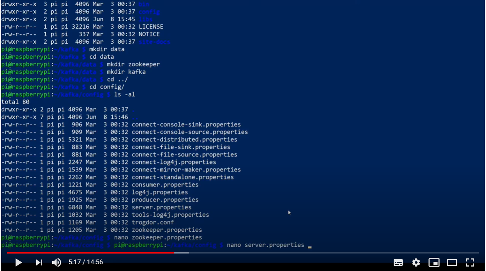
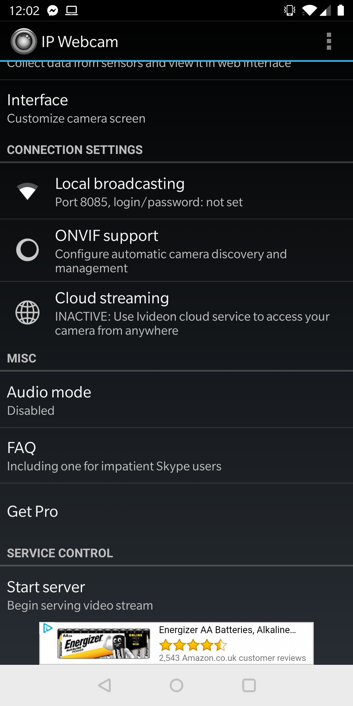

# kafka-RasPi-flask

This repository demonstrates the framework of using Kafka as the data handling tool, writing, receiving and recording message.
Flask is used as the front end to display message from Kafka and display on a web browser. 

## Prerequisite
- Kafka
    - Kafka 2.4.0 is used in the repo. 
- Raspberry Pi
    - I used Raspberry Pi 4 2GB but there is no reason why a less powerful Pi won't work 

- [IPWebcam](https://play.google.com/store/apps/details?id=com.pas.webcam&hl=en_GB) 
    - I run this Android app on my phone.  
    
## Kafka Installation 
Install Kafka on linux environment is straight forward. You could see the following YouTube tutorial for detailed instruction. 

[](https://youtu.be/yq4rLLZhmWU)

- Download Kafka from the official Apache Kafka [site.](https://kafka.apache.org/downloads) 
- Unzip the tar file to your desired location.  
#### Directory Structure
- I unzipped under Document. Create a sub folder called data, following by zookeeper and kafka underneath.
  The directory structure should look as follow: 

    .
    
    ├── Kafka                    
    │   ├── bin              
    │   ├── config           
    │   ├── lib             
    │   ├── logs            
    │   ├── data            
    │   │   ├── zookeeper   
    │   │   ├── kafka
            
            
#### Config Files
- Update the zookeeper config file zookeeper.properties. It is under Kafka/config
```bash
dataDir=/home/pi/Documents/kafka/data/zookeeper
```
   
- Update the kafka config file server.properties. It is under Kafka/config
```bash
listeners=PLAINTEXT://192.168.2.52:9092
log.dirs=/home/pi/Documents/kafka/data/kafka
```
#### Start server
```bash
bin/zookeeper-server-start.sh config/zookeeper.properties 
bin/kafka-server-start.sh config/server.properties
```

#### Create topic
```bash
 bin/kafka-topics.sh --create --bootstrap-server 192.168.2.52:9092 --replication-factor 1 --partitions 1 --topic kfakapokearound  
```
      
## Python Library Installation 
- Run the command prompt with admin privilege and install the Python package Poetry as follow: 
```bash
pip install poetry
```
- Restart the command prompt and cd to the repo directory 
- Install the required libraries by invoking poetry 
```bash
poetry install 
``` 
## Get Going

Use the following command, arguments in this specific order to run the script.
More information will be available in the future.  

- First of all you will need to start IPWebCam from your phone to broadcast accelerometer data to your network. 
<p align="center">

</p>
<p align="center">

</p>

- Start IPWebCam2KafkaProducer.py, this script read the json data then write the data to Kafka Producer. 
 ```bash
 python IPWebCam2KafkaProducer.py 192.168.2.52:9092 kafkapokearound 192.168.2.241 
```
- You can then start IPWebCam2KafkaConsumer.py, this script read the data from Kafka Consumer then print it out on the command prompt

 ```bash
 python IPWebCam2KafkaConsumer.py 192.168.2.52:9092 kafkapokearound 
```
- If the above script is working, you can move on broadcast the data to Flask front end 

```bash
python ConsumerFrontend.py 192.168.2.52 192.168.2.52:9092 kafkapokearound
```

## Contact 
- Github: https://github.com/jonathancychow
- Email:  jonathan@cychow.co.uk
